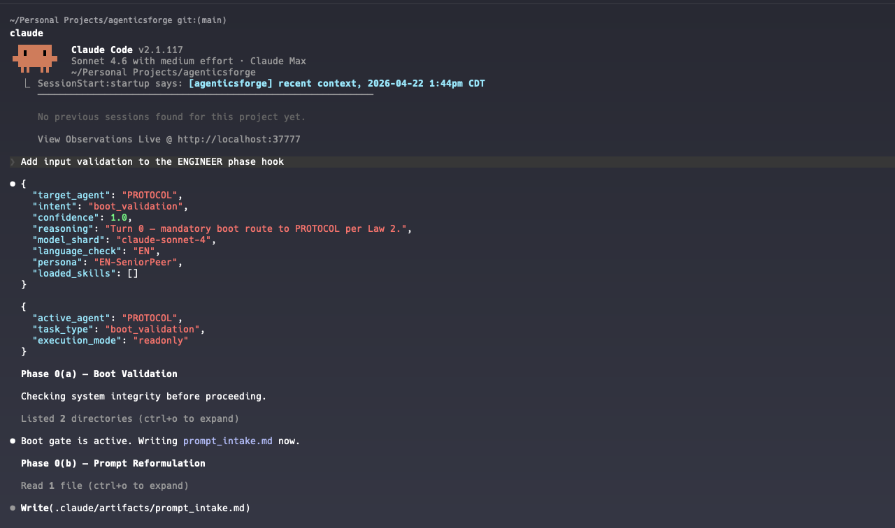
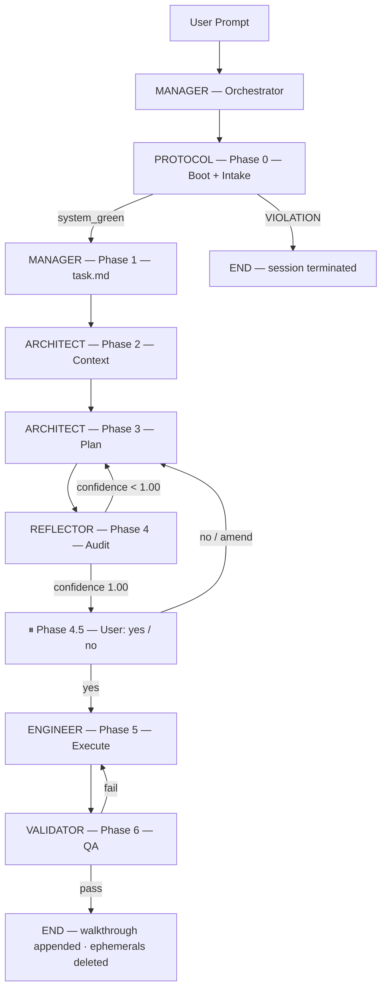
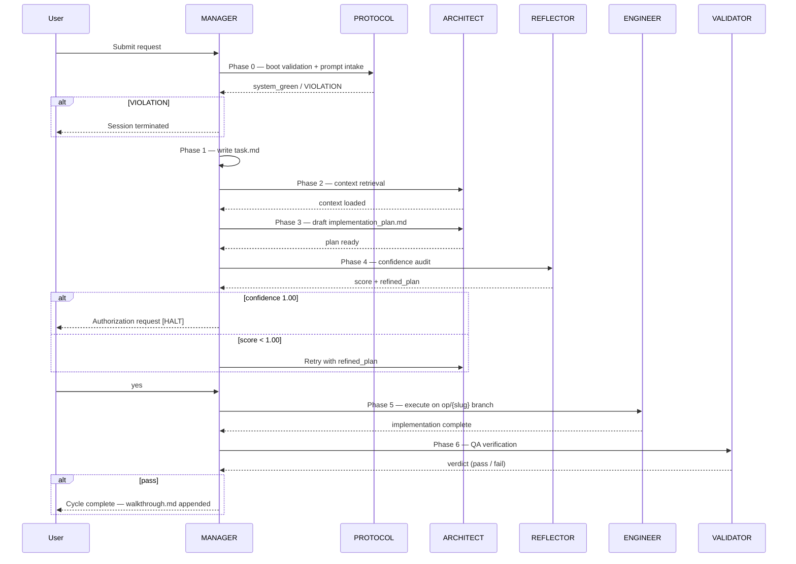

# Agentics Forge

A self-contained governance layer that enforces a 7-agent, 6-phase engineering protocol on every Claude Code session. Installed by copying a single directory into any project.

<!-- Claude / AI -->


<!-- DevX -->


---

## Table of Contents

- [Agentics Forge](#agentics-forge)
  - [Table of Contents](#table-of-contents)
  - [Preview](#preview)
  - [📖 Overview](#-overview)
    - [Highlights](#highlights)
  - [🚀 Install](#-install)
    - [Mode 1 — Project-Local](#mode-1--project-local)
    - [Mode 2 — Global](#mode-2--global)
    - [Mode 3 — Hybrid (Recommended)](#mode-3--hybrid-recommended)
    - [Verify the Install](#verify-the-install)
  - [🏗️ How It Works](#️-how-it-works)
    - [6-Phase Pipeline](#6-phase-pipeline)
    - [Workflow Sequence](#workflow-sequence)
  - [🤖 Agent Roster](#-agent-roster)
  - [🛠️ What You Get](#️-what-you-get)
  - [📁 Directory Structure](#-directory-structure)
  - [📚 Advanced Documentation](#-advanced-documentation)
  - [🤝 Contributing](#-contributing)
  - [📄 License](#-license)

---

## Preview



---

## 📖 Overview

**Agentics Forge** is a governance layer, not a library. It is a `.claude/` directory and `CLAUDE.md` file that you copy into any project — or globally into `~/.claude/` — and Claude Code automatically loads it on every session.

> **Claude Code only.** This system runs exclusively inside Claude Code (CLI, VS Code extension, or JetBrains plugin). It does not work properly with the raw Anthropic API or any other AI tool.

Once installed, every Claude Code session is governed by a strict 7-agent, 6-phase pipeline: PROTOCOL validates the boot before any work begins; ARCHITECT drafts a plan; REFLECTOR audits it to confidence 1.00; you authorize it; ENGINEER executes on a dedicated branch; VALIDATOR verifies. The entire behavioral contract lives in version-controlled `.claude/` files — inspectable, diff-able, and overridable like any other code.

### Highlights

- **Protocol Boot Gate:** PROTOCOL validates system integrity on every Turn 0. Violations terminate the session before any work begins — no shadow execution, no partial output.
- **Transparency Lock:** Every agent turn emits Tier 1 (MANAGER Routing JSON) + Tier 2 (Agent Execution JSON) as the absolute first output. Missing JSON = immediate session termination.
- **Confidence-Gated Critique:** REFLECTOR audits every plan with a multi-persona review. Plans below confidence 1.00 are returned to ARCHITECT with a refined draft — never cold re-drafted.
- **Single-Halt Atomicity:** Exactly one interactive halt per cycle — the Phase 4 authorization request. Everything before it runs in one continuous turn; everything after runs in one continuous turn.
- **Branch Isolation:** ENGINEER executes exclusively on `{op}/{slug}` branches. Direct writes to `main`/`master` are hard-blocked by `block-destructive.sh` at every tool call.
- **Skill Auto-Load:** MANAGER resolves relevant skills deterministically against `triggers.json` on every turn. Matched skills are recorded in Tier 1 JSON and loaded lazily before any agent acts.
- **3-Tier Model Routing:** MANAGER orchestrates on the parent session shard (immutable at launch). Sub-agents spawned via the `Agent` tool each carry an explicit `model` parameter, routing Tier 1 tasks to Opus, Tier 2 to Sonnet, and Tier 3 to Haiku. Every spawn emits a mandatory spawn-transparency JSON block — sub-agent model delegation is as visible as any other agent turn.
- **Drop-In Deploy:** No build step, no package install, no runtime dependency. Three copy-paste commands and Claude Code picks it up automatically.

---

## 🚀 Install

### Mode 1 — Project-Local

Governance lives in the repo. Shared with the team via git.

```bash
git clone https://github.com/cherubini-sam/agenticsforge.git /tmp/agenticsforge

cp -r /tmp/agenticsforge/.claude   /path/to/your-project/
cp    /tmp/agenticsforge/CLAUDE.md /path/to/your-project/CLAUDE.md
```

Commit `.claude/`, `.githooks/`, and `CLAUDE.md`. Add the following to `.gitignore`:

```
.claude/artifacts/*
!.claude/artifacts/.gitignore
.claude/settings.local.json
```

Activate the git hook after every fresh clone:

```bash
git config core.hooksPath .githooks
```

---

### Mode 2 — Global

Install once. Every Claude Code session on your machine loads this protocol, regardless of which project you open.

```bash
cp -r ~/.claude ~/.claude.bak      # backup first

cp -r /tmp/agenticsforge/.claude/. ~/.claude/
cp    /tmp/agenticsforge/CLAUDE.md ~/.claude/CLAUDE.md
```

> **Important — rewrite `${CLAUDE_PROJECT_DIR}` to `${HOME}` in `~/.claude/settings.json`.** The bundled `settings.json` resolves every hook path against `${CLAUDE_PROJECT_DIR}`, which is correct for project-local installs but does not exist in a global context. After copying, swap the variable:
>
> ```bash
> sed -i.bak 's|${CLAUDE_PROJECT_DIR}|${HOME}|g' ~/.claude/settings.json
> ```
>
> Hook commands then resolve to `${HOME}/.claude/hooks/...`, which is correct for global mode.

**Resolution order**: Managed policy → `~/.claude/CLAUDE.md` → `./CLAUDE.md` → `./CLAUDE.local.md`. All matching files are concatenated — project rules extend global rules, they do not replace them.

---

### Mode 3 — Hybrid (Recommended)

Protocol core lives globally. Project-specific rules and skills live per repo. Best of both.

```bash
# Step 1 — Core protocol globally
cp -r /tmp/agenticsforge/.claude/protocols ~/.claude/protocols
cp -r /tmp/agenticsforge/.claude/agents    ~/.claude/agents
cp -r /tmp/agenticsforge/.claude/rules     ~/.claude/rules
cp    /tmp/agenticsforge/CLAUDE.md         ~/.claude/CLAUDE.md

# Step 2 — Per-project extensions
mkdir -p your-project/.claude/{skills,rules,artifacts}
# Add project-specific .claude/rules/stack.md, skills/, etc.
```

---

### Verify the Install

```bash
cd /path/to/your-project
claude
```

On Turn 0 you should see Tier 1 + Tier 2 JSON as the **first output** — that confirms the protocol booted correctly:

```json
{
  "target_agent": "PROTOCOL",
  "intent": "boot_validation",
  "model_shard": "claude-sonnet-4-6",
  ...
}
```

---

## 🏗️ How It Works

### 6-Phase Pipeline

Every Claude Code session runs this pipeline — no task-type exemptions, no shortcuts.



### Workflow Sequence



---

## 🤖 Agent Roster

| Agent         | Phase                    | Role                                                                                                                |
| :------------ | :----------------------- | :------------------------------------------------------------------------------------------------------------------ |
| **MANAGER**   | Coordinator — all phases | Master orchestrator and intent router. Emits Tier 1/2 JSON on every turn. Enforces phase gates and skill auto-load. |
| **PROTOCOL**  | Phase 0 — boot           | Validates system integrity. Writes `prompt_intake.md`. Locks session language. Terminates on any violation.         |
| **ARCHITECT** | Phases 2–3 — plan        | Retrieves context. Drafts `implementation_plan.md`. Consumes REFLECTOR's `refined_plan` on retry loops.             |
| **REFLECTOR** | Phase 4 — critique       | Multi-persona confidence audit. Emits score + refined plan. Gates execution at 1.00.                                |
| **ENGINEER**  | Phase 5 — execution      | Executes the authorized plan exclusively on `{op}/{slug}` branches. Receives force-execute after max retries.       |
| **VALIDATOR** | Phase 6 — QA             | Verifies output against task and plan. Produces pass/fail verdict; gates cycle close or retry.                      |
| **LIBRARIAN** | Cross-phase — docs       | Knowledge retrieval, documentation synchronization, research aggregation.                                           |

---

## 🛠️ What You Get

| Capability                       | Mechanism                                                                                      |
| :------------------------------- | :--------------------------------------------------------------------------------------------- |
| Protocol boot enforcement        | `enforce-boot-gate.sh` — PreToolUse hook blocks all tool calls until `prompt_intake.md` exists |
| Phase gate enforcement           | `enforce-phase-gate.sh` — PreToolUse hook gates each phase on required artifact presence       |
| Sub-agent spawn transparency     | `enforce-spawn-transparency.sh` — PreToolUse hook blocks `Agent`/`Task` calls missing the `sub_agent_spawn` JSON block |
| `main`/`master` write protection | `block-destructive.sh` — hard-blocks direct writes, force-push, `--no-verify`, `DROP TABLE`    |
| Tier 1/2 JSON transparency       | CLAUDE.md Law 1 + agent behavioral contracts in `.claude/agents/`                              |
| Confidence-gated planning        | REFLECTOR agent — confidence 1.00 required before ENGINEER is authorized                       |
| Ephemeral artifact sandbox       | `.claude/artifacts/` — gitignored, purged at Phase 6 close                                     |
| Skill auto-load per turn         | `.claude/skills/triggers.json` — deterministic keyword/regex/glob matching                     |
| Cross-cycle audit trail          | `.claude/artifacts/walkthrough.md` — permanent, append-only                                    |
| Multilingual session support     | `.claude/protocols/communication.md` — persona matrix                                          |
| 3-tier sub-agent model routing   | `.claude/rules/stack.md` — Opus/Sonnet/Haiku delegation via `Agent` tool `model` param        |

---

## 📁 Directory Structure

```
.claude/
├── CLAUDE.md                     # Project instructions — auto-loaded by Claude Code
├── settings.json                 # Hooks, permissions, env vars — committed, shared
├── settings.local.json           # Personal overrides — gitignored
│
├── agents/                       # Sub-agent definitions (*.md) — auto-loaded
│   ├── manager.md
│   ├── protocol.md
│   ├── architect.md
│   ├── reflector.md
│   ├── engineer.md
│   ├── validator.md
│   └── librarian.md
│
├── protocols/                    # Core laws, phase gates, workflow — on-demand
│   ├── core-laws.md
│   ├── phase-gate.md
│   ├── communication.md
│   └── ...
│
├── rules/                        # Path-scoped instruction files (*.md) — auto-loaded
│   ├── stack.md
│   ├── boundaries.md
│   ├── behavioral-enforcement.md
│   ├── workflow-manager.md
│   └── ...
│
├── skills/                       # Skill definitions — deterministic auto-load
│   ├── triggers.json
│   └── <skill-name>/SKILL.md
│
├── resources/                    # Artifact templates — on-demand
│   ├── task.md
│   ├── prompt-intake.md
│   └── implementation-plan.md
│
├── hooks/                        # Shell scripts referenced in settings.json
│   ├── _resolve-config-dir.sh    # Internal helper sourced by other hooks
│   ├── session-bootstrap.sh
│   ├── validate-skills.sh
│   ├── enforce-boot-gate.sh
│   ├── enforce-phase-gate.sh
│   ├── block-destructive.sh
│   ├── enforce-spawn-transparency.sh
│   ├── format-code.sh
│   ├── verify-tests.sh
│   └── notify-completion.sh      # Optional Stop hook (not wired by default)
│
└── artifacts/                    # Ephemeral sandbox — gitignored, never committed
    ├── prompt_intake.md          # Phase 0(b) — deleted at Phase 6
    ├── task.md                   # Phase 1   — deleted at Phase 6
    ├── implementation_plan.md    # Phase 3   — deleted at Phase 6
    └── walkthrough.md            # Permanent — append-only, cross-cycle record
```

---

## 📚 Advanced Documentation

For install commands, config reference, hooks setup, and the full Conventional Commits protocol, see [CHEATSHEET.md](CHEATSHEET.md).

---

## 🤝 Contributing

Contributions are welcome. Ensure all pre-commit hooks pass and commit messages conform to the Conventional Commits protocol before submitting a pull request.

---

## 📄 License

See [LICENSE](LICENSE) for details.

**Maintainer:** Samuele Cherubini — cherubini.sam@gmail.com
